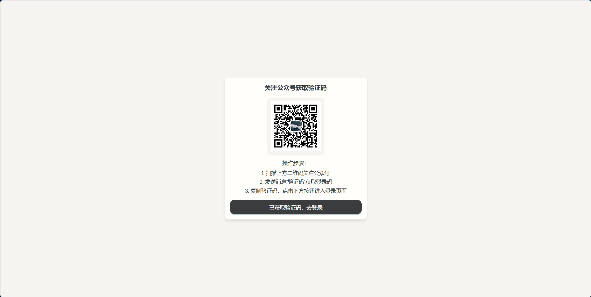
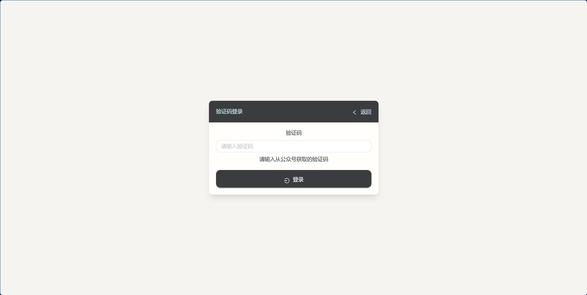
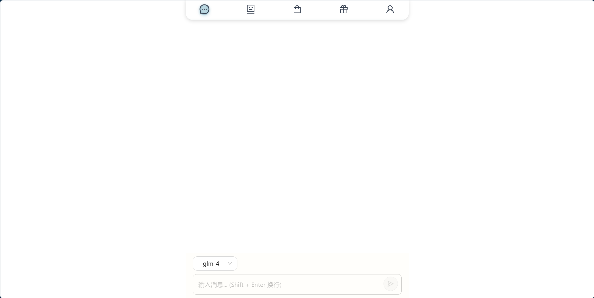
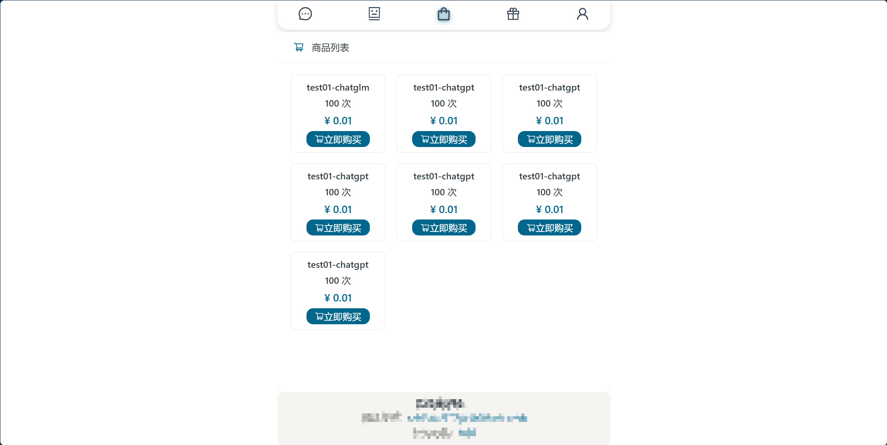
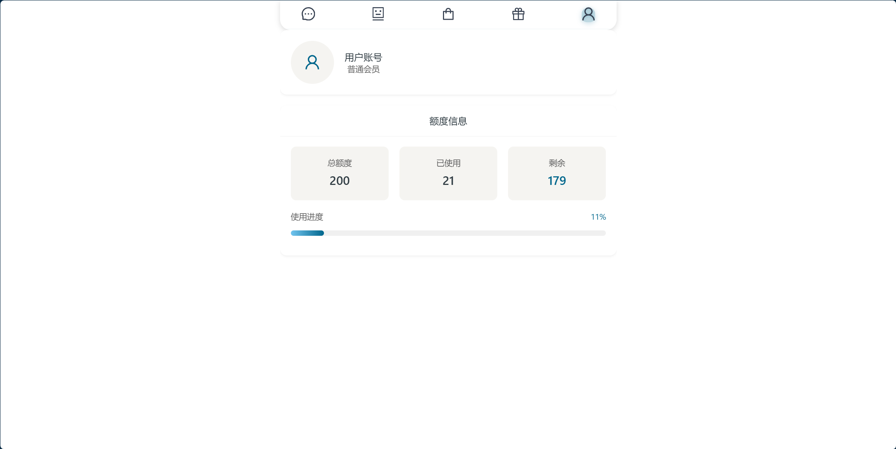

# chatAI-web

[](https://github.com/mynxg/chat-ai-web/stargazers)
[](https://github.com/mynxg/chat-ai-web/issues)
[](https://github.com/mynxg/chat-ai-web/issues?q=is%3Aissue+is%3Aclosed)
[](https://github.com/mynxg/chat-ai-web/pulls)
[](https://github.com/mynxg/chat-ai-web/pulls?q=is%3Apr+is%3Aclosed)

[中文](./README.md) | English

## Project Introduction

This is an AI chat web application where users can place orders to purchase Q&A credits for different models. Future features will include sign-in lotteries and more.

## Features

- [√] AI Q&A
- [√] Place Orders
- [x] Lottery

## Installation Steps

1. Clone the repository to your local machine:

   ```bash
   git clone git@github.com:mynxg/chat-ai-web.git
   cd chat-ai-web
   ```

2. Install dependencies:

   ```bash
   npm install
   ```

3. Create and configure the `.env.local` file:
   ```plaintext
   VITE_CHATAI_API_URL=http://localhost:8081/api
   ```

## Usage

1. Start the development server:

   ```bash
   npm run dev
   ```

2. Open [http://localhost:3333](http://localhost:3333) in your browser.

3. Follow the public account to receive a verification code and log in.

## Configuration Modification

Modify the API endpoint in the `.env.local` file:

```plaintext
VITE_CHATAI_API_URL=http://localhost:8081/api
```

Vercel Deployment Guide
Log in to Vercel and create a new project.

Choose to import a GitHub repository and select your project repository (chat-ai-web).

In the project settings, add the following environment variable:

VITE_CHATAI_API_URL: Set this to your API URL, for example, https://your-api-url.com
Click the “Deploy” button to start the deployment.

Once deployed, you can access your application using the domain provided by Vercel.

Demo

<details><summary><a>👉Show More</a></summary></br>










</details>
Contribution
Contributions are welcome! Please submit a Pull Request or report an issue.

License
This project is licensed under the MIT License.

Star History


