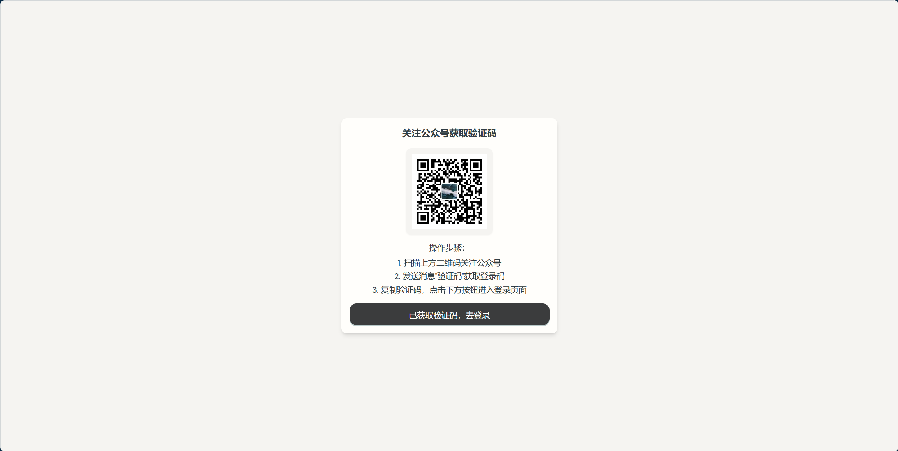
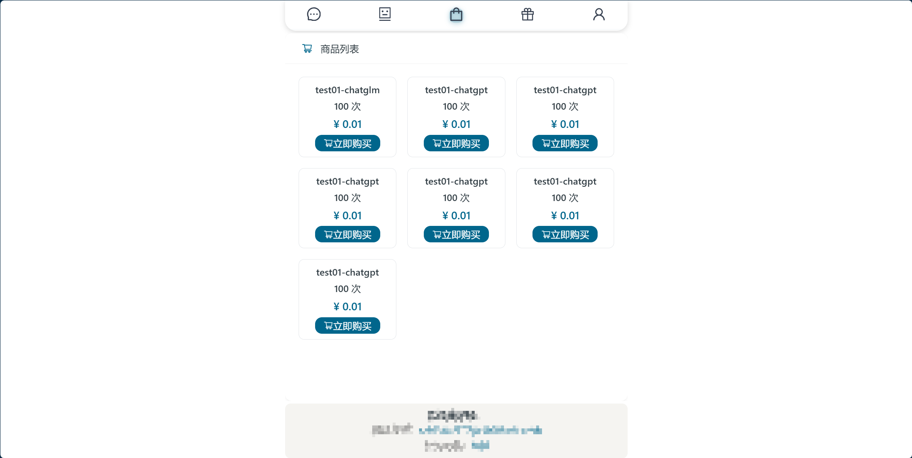

# chatAI-web

[](https://github.com/mynxg/chat-ai-web/stargazers)
[](https://github.com/mynxg/chat-ai-web/issues)
[](https://github.com/mynxg/chat-ai-web/issues?q=is%3Aissue+is%3Aclosed)
[](https://github.com/mynxg/chat-ai-web/pulls)
[](https://github.com/mynxg/chat-ai-web/pulls?q=is%3Apr+is%3Aclosed)

简体中文 | [English](README-EN.md)

## 项目介绍

这是一个ai对话web，可以进行下单购买不同模型的问答次数，后续支持支持签到抽奖等功能

## 功能

- [√] AI问答
- [√] 下单
- [x] 抽奖

## 安装步骤

1. 克隆仓库到本地：

   ```bash
   git clone git@github.com:mynxg/chat-ai-web.git
   cd chat-ai-web
   ```

2. 安装依赖：

   ```bash
   npm install
   ```

3. 创建并配置 `.env.local` 文件：
   ```plaintext
   VITE_CHATAI_API_URL=http://localhost:8081/api
   ```

## 使用方法

1. 启动开发服务器：

   ```bash
   npm run dev
   ```

2. 在浏览器中打开 [http://localhost:3333](http://localhost:3333)。

3. 关注公众号，获取验证码，登录

## 配置修改

在 `.env.local` 文件中修改接口地址：

```plaintext
VITE_CHATAI_API_URL=http://localhost:8081/api
```

## Vercel 部署教程

登录 [Vercel](https://vercel.com/) 并创建一个新项目。

选择导入 GitHub 仓库，并选择你的项目仓库（chat-ai-web）。

在项目设置中，添加环境变量：

VITE_CHATAI_API_URL：设置为你的 API 地址，例如 https://your-api-url.com
点击“Deploy”按钮开始部署。

部署完成后，你可以在 Vercel 提供的域名上访问你的应用。

## 效果展示

<details><summary><a>👉显示更多</a></summary></br>







</details>

## 贡献

欢迎贡献代码！请提交 Pull Request 或报告问题。

## 许可证

此项目使用 [MIT License](./LICENSE) 许可证。

## Star History

[](https://star-history.com/#mynxg/chat-ai-web&Date)
